# 项目工程结构说明

本文档描述当前智能客服项目的工程目录、分层职责和主要文件关系。目标是让后续继续优化 Skill、AgentRuntime、MCP 工具、前端应用时，能保持边界清晰。

## 整体结构图

```mermaid
flowchart TD
  Root["智能客服项目根目录"]
  Root --> Frontend["frontend: React 客服应用"]
  Root --> Backend["backend: FastAPI 后端"]
  Root --> MCPServer["mcp_server: 独立 MCP Server"]
  Root --> Skills["skills: 可插拔业务 Skill"]
  Root --> Docs["docs: 设计与实现文档"]
  Root --> Readme["README.md / PROJECT_STRUCTURE.md"]

  Frontend --> FEApp["src/App.tsx: 登录、注册、客服会话 UI"]
  Frontend --> FEApi["src/api.ts: HTTP API 客户端"]
  Frontend --> FETypes["src/types.ts: 前端类型"]
  Frontend --> FEStyle["src/styles.css: 页面样式"]

  Backend --> API["app/api: Web API"]
  Backend --> Runtime["app/agent: AgentRuntime 内核"]
  Backend --> Infra["app/infrastructure: 外部能力适配"]
  Backend --> Schemas["app/schemas: API 数据模型"]
  Backend --> DB["db: MySQL schema 与 seed"]
  Backend --> Knowledge["knowledge: 本地知识库 Markdown"]
  Backend --> Tests["tests: 自动化测试"]

  API --> AuthAPI["auth.py: 登录与注册"]
  API --> ChatAPI["chat.py: 对话入口"]

  Runtime --> AgentRuntime["runtime.py: observe-act loop"]
  Runtime --> Actions["actions.py: Action / Observation"]
  Runtime --> Context["context.py: TurnContext / TraceEvent"]
  Runtime --> Executor["executor.py: ActionExecutor"]
  Runtime --> ToolRegistry["tool_registry.py: 工具契约"]
  Runtime --> Guardrails["guardrails.py: 通用安全检查"]
  Runtime --> Contracts["contracts.py: 框架协议"]
  Runtime --> Registry["registry.py: Skill 选择"]

  Infra --> MCP["mcp: MCP 工具层"]
  Infra --> LLM["llm: LLM 适配器"]
  Infra --> Memory["memory / sessions: Event-Entity 记忆与会话"]
  Infra --> KSearch["knowledge: 本地知识检索"]
  Infra --> SkillLoader["skills: 文件型 Skill 加载"]

  MCP --> MockMCP["mock_gateway.py"]
  MCP --> MySQLMCP["mysql_gateway.py: MySQL 薄适配器"]
  MCP --> RemoteMCP["remote_gateway.py: 远程 MCP HTTP 网关"]
  MCP --> CSPlugin["customer_service/: 客服 MCP 插件包"]
  CSPlugin --> Plugin["plugin.py: 工具包入口"]
  CSPlugin --> Tools["tools.py: 客服工具 handler"]
  CSPlugin --> MCPContext["context.py: MCP 上下文"]
  CSPlugin --> MCPUtils["utils.py: 通用结果与转换"]

  Skills --> CSSkill["customer_service_core: 客服业务策略"]
  Skills --> KBSkill["knowledge-base-authoring: 知识卡片生成"]

  MCPServer --> MCPMain["app/main.py: 独立 HTTP MCP-compatible 服务"]
  MCPServer --> MCPFactory["app/plugin_factory.py: 复用客服 MCP 工具包"]
```



## 顶层目录

```text
.
├── backend/                      # 后端服务、AgentRuntime、MCP、数据库与测试
├── mcp_server/                   # 独立 HTTP MCP-compatible Server
├── frontend/                     # React 客服前端
├── skills/                       # 可插拔业务 Skill
├── docs/                         # 设计文档和技术说明
├── README.md                     # 项目启动与基础说明
├── PROJECT_STRUCTURE.md          # 当前工程结构说明
└── .gitignore                    # 忽略运行产物、缓存、环境文件
```

## 后端结构

```text
backend/
├── app/
│   ├── api/                      # HTTP API 层
│   │   ├── auth.py               # 登录、注册
│   │   └── chat.py               # 对话接口
│   ├── agent/                    # AgentRuntime 通用内核
│   │   ├── runtime.py            # 主运行循环
│   │   ├── actions.py            # Action 与 Observation
│   │   ├── context.py            # TurnContext 和 trace
│   │   ├── executor.py           # Action 执行器
│   │   ├── guardrails.py         # 通用安全检查
│   │   ├── registry.py           # Skill 选择
│   │   ├── tool_registry.py      # 工具 schema 契约
│   │   ├── contracts.py          # 框架协议接口
│   │   └── dependencies.py       # 当前应用装配
│   ├── infrastructure/           # 外部依赖适配层
│   │   ├── mcp/                  # MCP 工具层
│   │   ├── knowledge/            # 本地知识索引检索
│   │   ├── llm/                  # LLM 客户端
│   │   ├── memory/               # 长期 Event-Entity 记忆
│   │   ├── sessions/             # 短期会话
│   │   └── skills/               # Skill 文件加载
│   ├── schemas/                  # Pydantic 数据模型
│   └── main.py                   # FastAPI 应用入口
├── db/
│   ├── schema.sql                # MySQL 建表
│   └── seed.sql                  # 模拟数据
├── knowledge/                    # 本地知识库 Markdown
└── tests/                        # 后端测试
```

## MCP 工具层

```text
backend/app/infrastructure/mcp/
├── mock_gateway.py               # 无数据库演示网关
├── mysql_gateway.py              # MySQL 适配器，只负责连接和转发
├── remote_gateway.py             # 调用独立 MCP Server 的 HTTP 网关
└── customer_service/             # 客服 MCP 插件包
    ├── __init__.py
    ├── plugin.py                 # CustomerServiceMCPPlugin
    ├── audit.py                  # MCP 工具调用 JSONL 审计
    ├── tools.py                  # user/order/ticket/handoff/knowledge 工具
    ├── context.py                # 工具运行上下文
    └── utils.py                  # 标准失败结果、JSON 转换、摘要
```

当前 MCP 分层原则：

- `AgentRuntime` 只调用 `MCPGateway` 协议。
- `MySQLMCPGateway` 只做适配，不写具体客服工具逻辑。
- `RemoteMCPGateway` 通过 HTTP 调用 `mcp_server`，让 Agent 后端和 MCP 工具进程分离。
- `CustomerServiceMCPPlugin` 是客服工具包入口。
- 每个工具 handler 只负责一个业务能力。
- `ToolRegistry` 在 AgentRuntime 内负责工具契约校验，MCP 工具层负责真实执行。

## 独立 MCP Server

```text
mcp_server/
├── app/
│   ├── main.py                   # HTTP MCP-compatible 服务入口
│   ├── config.py                 # 独立 MCP Server 配置
│   ├── plugin_factory.py         # 组装 CustomerServiceMCPPlugin
│   └── schemas.py                # 工具调用请求/响应模型
├── tests/
│   └── test_http_mcp_server.py   # 独立 MCP Server 测试
├── pyproject.toml
└── .env.example
```

当前分离方式：

- Agent 后端使用 `CS_AGENT_MCP_BACKEND=remote`。
- Agent 后端通过 `RemoteMCPGateway` 调用 `http://localhost:9001/tools/call`。
- 独立 MCP Server 复用 `CustomerServiceMCPPlugin`，继续执行知识库、MySQL、视觉模型和客服工具。
- 工具返回格式保持不变，Skill 和前端不需要知道 MCP 是内部还是远程。

详细设计见 `docs/remote-mcp-server-design.md`。

## Skill 结构

```text
skills/
└── customer_service_core/
    ├── manifest.yaml             # Skill 元信息
    ├── SKILL.md                  # 主策略说明
    ├── agents/
    │   └── openai.yaml           # Agent 集成配置
    └── references/               # 业务策略参考资料
        ├── persona.md
        ├── conversation_policy.md
        ├── mcp_policy.md
        ├── order_playbook.md
        ├── after_sales_playbook.md
        └── ...
└── knowledge-base-authoring/
    ├── manifest.yaml             # 项目运行时 Skill 元信息
    ├── SKILL.md                  # 知识卡片生成工作流
    ├── agents/
    │   └── openai.yaml           # Codex UI 元信息
    └── references/
        └── card-schema.md        # 知识卡片字段和写作规范
```

Skill 负责客服策略和业务判断，不直接连接数据库，也不持有前端登录逻辑。

`knowledge-base-authoring` 是维护型 Skill，用于生成和审查 `backend/knowledge/**/*.md` 静态知识卡片，不替代 `knowledge.search` MCP 工具。

## 前端结构

```text
frontend/
├── src/
│   ├── App.tsx                   # 登录、注册、客服会话页面
│   ├── api.ts                    # auth/chat HTTP 请求
│   ├── types.ts                  # 前端类型定义
│   ├── styles.css                # UI 样式
│   └── main.tsx                  # React 入口
├── package.json
├── tsconfig.json
└── vite.config.ts
```

前端只负责应用交互：

- 登录 / 注册
- 当前用户展示
- 会话记录、新会话、删除会话
- 客服聊天窗口
- 最近订单与快捷问题展示

前端不参与 AgentRuntime 决策，也不直接调用 MCP。

## 边界原则

- `frontend` 是应用 UI。
- `backend/app/api` 是 Web API 外壳。
- `backend/app/agent` 是通用 AgentRuntime 内核。
- `skills` 是业务策略插件。
- `backend/app/infrastructure/mcp` 是工具执行层。
- `backend/knowledge` 是知识数据。
- `backend/db` 是数据库结构与模拟数据。

后续新增能力时，优先放到对应层，不把业务逻辑塞进 AgentRuntime。
