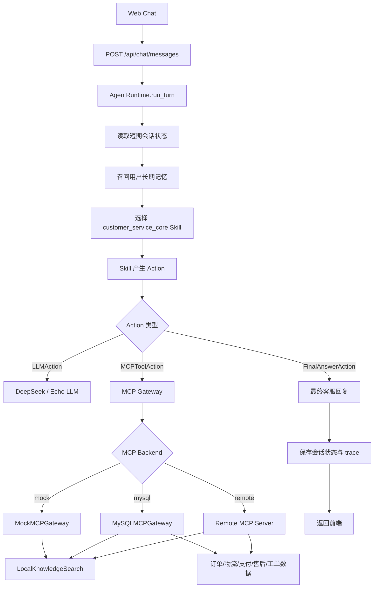

# Skill + MCP 智能电商客服

这是一个面向电商售前、售后、订单、物流、支付、工单和人工转接场景的智能客服项目。它不是把 FAQ、向量库和大模型简单拼在一起的普通客服 Demo，而是把基础 Agent Runtime、可插拔 Skill、MCP 工具能力和电商知识检索拆成清晰边界，方便扩展、替换、维护和接入真实业务系统。

## 项目亮点

- **Skill 承载客服策略**：客服身份、话术边界、意图判断、追问策略、售后流程、转人工规则等都沉淀在 `skills/customer_service_core`，不会散落在后端业务代码里。
- **MCP 承载业务能力**：订单查询、物流查询、支付查询、售后查询、工单创建、人工转接、知识搜索都通过 MCP Gateway/Tool 暴露，便于从 mock 切换到 MySQL、远程 MCP Server 或真实企业系统。
- **基础 Agent Runtime 保持轻量**：Runtime 只负责会话状态、技能选择、Action 执行、LLM 调用、MCP 调用和 trace，不把客服业务规则写死在框架里。
- **知识搜索不依赖传统向量检索**：针对电商知识的稳定结构，项目使用本地 Markdown 知识卡片、L0/L1/L2 层级索引、QueryPlan、多路召回、倒排索引和规则 rerank，结果可解释、低成本、易维护。
- **高插拔、可解耦**：LLM、MCP 后端、知识库、会话存储、长期记忆、数据库网关都通过协议或适配器组织，后续替换供应商或接入真实系统时改动范围更小。
- **更适合电商客服的安全边界**：订单归属校验、敏感字段脱敏、MCP 审计日志、人工升级策略和工具权限边界都在架构中显式体现。
- **知识库维护友好**：产品参数、价保、退换货、物流、发票、兼容性、促销等知识以 Markdown 卡片组织，配合 `knowledge-base-authoring` skill 更容易持续更新。

## 与普通电商客服的不同

普通客服机器人常见做法是“用户问题 -> 向量检索 FAQ -> LLM 总结回复”，短期能跑，但容易遇到几个问题：知识命中不可解释、业务动作难审计、售后流程散乱、工具接入强耦合、后续维护成本高。

这个项目采用分层组合：

```text
用户消息
  -> Agent Runtime
  -> customer_service_core Skill
  -> MCP Capability / Tool
  -> 订单、物流、支付、售后、工单、知识库等业务能力
  -> Skill 整理为客服回复
```

也就是说：

- Skill 决定“客服应该怎么思考和表达”。
- MCP 决定“业务能力如何被安全调用”。
- Agent Runtime 决定“对话一轮怎么编排和落盘”。
- Knowledge Search 决定“电商知识如何被稳定、可解释地召回”。

这种结构让客服策略、工具能力、模型供应商和数据源彼此独立，项目从 Demo 走向真实业务接入时不需要整体推倒重来。

## 系统结构

```text
.
├── backend/                      # FastAPI 后端、Agent Runtime、MCP 网关、知识检索、测试
│   ├── app/
│   │   ├── agent/                # Runtime、Action、Executor、Skill Registry、Tool Registry
│   │   ├── api/                  # 登录、注册、聊天 API
│   │   ├── core/                 # 环境配置
│   │   ├── infrastructure/       # LLM、MCP、Knowledge、Memory、Session、Skill Loader
│   │   └── schemas/              # Pydantic 模型
│   ├── db/                       # MySQL schema 和 seed
│   ├── knowledge/                # 电商知识 Markdown 卡片
│   └── tests/                    # 后端测试
├── frontend/                     # React Web 客服界面
├── mcp_server/                   # 独立 HTTP MCP-compatible Server
├── skills/                       # 可插拔 Skill 包
│   ├── customer_service_core/    # 核心客服策略 Skill
│   └── knowledge-base-authoring/ # 知识卡片维护 Skill
├── docs/                         # 架构、MCP、知识检索、实现说明
├── PROJECT_STRUCTURE.md          # 工程结构说明
└── README.md
```

## 核心流程



## MCP 工具能力

当前客服 MCP 工具包括：

| 工具 | 作用 |
| --- | --- |
| `knowledge.search` | 查询商品、政策、售后、物流、促销、兼容性等静态知识 |
| `user.lookup` | 查询当前用户服务上下文，只返回安全、脱敏的信息 |
| `order.lookup` | 查询订单总览和商品明细，并校验用户归属 |
| `shipment.lookup` | 查询物流状态、承运商、运单号和预计送达时间 |
| `payment.lookup` | 查询支付状态、支付方式和脱敏交易信息 |
| `after_sales.lookup` | 查询售后记录和处理状态 |
| `ticket.create` | 创建客服工单 |
| `handoff.request` | 请求人工客服转接 |

## 知识检索设计

项目没有把知识检索直接做成传统向量库 RAG，而是针对电商知识的特点实现了可解释的本地检索：

1. 使用 Markdown 知识卡片保存商品、政策、物流、售后、发票、兼容性、促销等内容。
2. 构建 L0/L1/L2 层级索引：先定位类别和卡片，再进入正文证据片段。
3. 用规则型 QueryPlan 把用户问题拆成多路查询，例如商品参数、售后政策、兼容性、价保规则。
4. 用倒排索引召回候选，并通过标题、关键词、正文、分类、精确短语、证据片段和热度做轻量 rerank。
5. 返回命中原因、证据片段和关联知识，方便 Skill 生成有依据的客服回复。

这样做的好处是成本低、冷启动快、可解释性强，也更适合维护电商场景里大量稳定但经常更新的规则型知识。

## 本地运行

### 1. 后端

```bash
cd backend
python -m venv .venv
.venv\Scripts\activate
pip install -e .[dev]
copy .env.example .env
uvicorn app.main:app --reload --port 8001
```

后端接口：

- `GET /health`
- `POST /api/chat/messages`

### 2. 前端

```bash
cd frontend
npm install
npm run dev
```

前端默认请求 `http://localhost:8001`，可通过 `VITE_API_BASE_URL` 覆盖。

### 3. 独立 MCP Server

如果希望让 Agent 后端通过远程 MCP Server 调工具，可以先启动：

```bash
cd mcp_server
python -m venv .venv
.venv\Scripts\activate
pip install -e .
copy .env.example .env
uvicorn app.main:app --host 0.0.0.0 --port 9001
```

然后在 `backend/.env` 中设置：

```env
CS_AGENT_MCP_BACKEND=remote
CS_AGENT_MCP_SERVER_URL=http://localhost:9001
```

## 配置说明

请不要把真实 `.env` 提交到仓库。项目只保留 `.env.example`，真实配置应在本地创建：

```env
deepseek_key=replace-with-your-deepseek-key
CS_AGENT_DEEPSEEK_MODEL=deepseek-v4-flash
CS_AGENT_DEEPSEEK_BASE_URL=https://api.deepseek.com

CS_AGENT_QWEN_VL_API_KEY=replace-with-your-qwen-vl-key
CS_AGENT_QWEN_VL_MODEL=qwen3-vl-flash
CS_AGENT_QWEN_VL_BASE_URL=https://dashscope.aliyuncs.com/compatible-mode/v1

CS_AGENT_MCP_BACKEND=mock
CS_AGENT_MCP_SERVER_URL=http://localhost:9001
CS_AGENT_MCP_TIMEOUT_SECONDS=30

CS_AGENT_MYSQL_HOST=localhost
CS_AGENT_MYSQL_PORT=3306
CS_AGENT_MYSQL_USER=replace-with-your-mysql-user
CS_AGENT_MYSQL_PASSWORD=replace-with-your-mysql-password
CS_AGENT_MYSQL_DATABASE=customer_service_agent
```

## 测试

后端：

```bash
cd backend
pytest
```

前端：

```bash
cd frontend
npm run build
```

## 进一步阅读

- `PROJECT_STRUCTURE.md`：工程结构和模块职责。
- `docs/agent-architecture.md`：高解耦智能客服 Agent 架构规范。
- `docs/mcp-capability-design.md`：MCP 能力与工具设计。
- `docs/knowledge-search-retrieval-design.md`：知识检索流程与技术原理。
- `docs/technical-implementation-overview.md`：当前实现细节总览。

