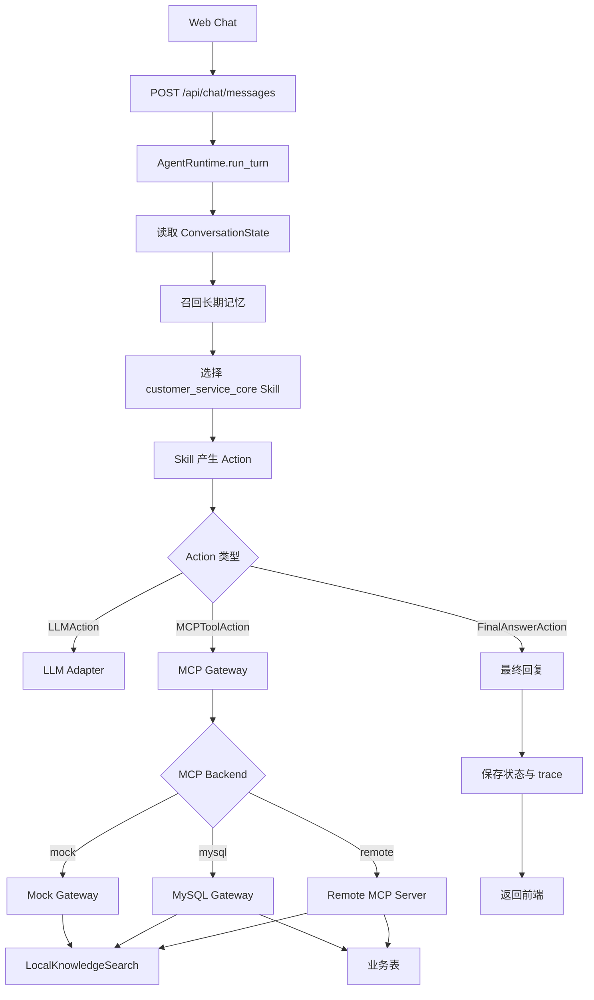

# 电商智能客服—Skill MCP

面向电商客服场景的可插拔 Agent 工程样例。项目把客服策略、对话编排、业务工具和知识检索拆分为相对独立的层次：基础 Agent Runtime 负责会话与执行，Skill 负责客服策略，MCP 负责业务能力边界，本地知识检索负责商品与政策类静态知识。

这个仓库适合用于研究或二次开发以下问题：

- 电商客服 Agent 如何组织售前、售后、订单、物流、支付、工单、转人工等多类能力。
- 如何把客服流程沉淀成可维护的 Skill 包，而不是散落在后端代码或单段提示词中。
- 如何用 MCP 把订单、物流、支付、售后、工单等业务系统从 Agent 中解耦出来。
- 如何在不依赖向量数据库的情况下，为电商知识库实现可解释、可维护的检索流程。

## 设计目标

本项目并不追求“一个大模型直接回答所有问题”。它更关注工程边界：

| 层次 | 主要职责 | 不负责 |
| --- | --- | --- |
| Agent Runtime | 会话状态、Skill 选择、Action 执行、LLM 调用、MCP 调用、trace | 具体客服业务规则 |
| Skill | 意图判断、客服流程、追问策略、工具使用策略、回复组织、转人工判断 | 直接访问数据库或外部系统 |
| MCP Tool | 订单、物流、支付、售后、工单、人工转接、知识搜索等业务能力 | 决定客服话术 |
| Knowledge Search | 商品、政策、促销、兼容性、物流、售后等静态知识召回 | 用户订单等私有数据查询 |

这种拆分的价值在于：客服规则可以独立维护，业务系统可以替换，模型供应商可以切换，知识检索策略也可以单独演进。

## Skill 设计

项目中的 Skill 不是单个 prompt，也不是一个固定函数，而是领域策略包。它描述客服在某个业务域内如何工作：如何识别意图、如何追问缺失信息、什么时候调用 MCP、如何解释工具结果、哪些场景必须转人工、回复时应遵守什么口径。

当前核心 Skill 位于：

```text
skills/customer_service_core/
├── manifest.yaml                 # Skill 元数据、能力声明、意图和优先级
├── SKILL.md                      # 主策略说明
├── agents/openai.yaml            # 面向模型运行的配置
└── references/
    ├── persona.md                # 客服角色与表达风格
    ├── intent_taxonomy.md        # 电商客服意图分类
    ├── conversation_policy.md    # 多轮对话策略
    ├── knowledge_playbook.md     # 知识查询策略
    ├── mcp_policy.md             # MCP 工具调用边界
    ├── order_playbook.md         # 订单相关流程
    ├── after_sales_playbook.md   # 售后流程
    ├── complaint_playbook.md     # 投诉处理流程
    ├── handoff_policy.md         # 人工转接规则
    ├── response_templates.md     # 回复模板
    └── evaluation_cases.md       # 评估用例
```

这样组织 Skill 有几个实际收益：

- 业务口径集中维护。活动规则、售后策略、转人工标准发生变化时，优先修改 Skill 资料，而不是改 Agent 框架。
- Skill 与模型解耦。DeepSeek、OpenAI 或其他模型可以共用同一套客服策略。
- Skill 与数据源解耦。Skill 只描述“需要什么能力”，真实数据访问交给 MCP。
- 易于扩展。后续可以拆出售前导购、售后专家、投诉处理、知识库编写等独立 Skill。
- 易于评估。典型客服问题可以沉淀到 `evaluation_cases.md`，用于检查工具调用、权限边界和回复质量。

## MCP 能力边界

MCP 是业务能力边界，也是权限与审计边界。当前工具包括：

| 工具 | 用途 |
| --- | --- |
| `knowledge.search` | 查询商品、政策、售后、物流、促销、兼容性等静态知识 |
| `user.lookup` | 查询当前用户服务上下文，返回脱敏后的身份、会员和最近订单提示 |
| `order.lookup` | 查询订单总览和商品明细，并校验订单归属 |
| `shipment.lookup` | 查询物流状态、承运商、运单号和预计送达时间 |
| `payment.lookup` | 查询支付状态、支付方式和脱敏交易信息 |
| `after_sales.lookup` | 查询售后记录和处理状态 |
| `ticket.create` | 创建客服工单 |
| `handoff.request` | 请求人工客服转接 |

后端支持三类 MCP 后端：

- `mock`：无数据库演示模式。
- `mysql`：通过 MySQL 网关访问本地业务表。
- `remote`：通过 HTTP 调用独立 MCP Server。

## 知识检索

电商知识通常具有明确的业务分类和稳定结构，例如商品参数、价保规则、退换货政策、发票规则、物流限制、兼容性说明。项目没有把这部分直接做成传统向量库 RAG，而是实现了一个本地、可解释的检索流程：

1. 使用 Markdown 知识卡片保存商品、政策、售后、物流、促销、兼容性等内容。
2. 构建 L0/L1/L2 层级索引：先定位类别和卡片，再进入正文证据片段。
3. 通过规则型 QueryPlan 将用户问题拆成多路查询。
4. 使用倒排索引召回候选，并基于标题、关键词、正文、分类、精确短语、证据片段和热度做轻量 rerank。
5. 返回命中原因、证据片段和关联知识，供 Skill 组织客服回复。

这个方案的优势是冷启动成本低、检索过程可解释、知识维护方式接近业务文档。它也保留了后续接入 Elasticsearch、向量库或外部 reranker 的空间。

## 运行流程



## 目录结构

```text
.
├── backend/
│   ├── app/
│   │   ├── agent/                # Runtime、Action、Executor、Skill Registry、Tool Registry
│   │   ├── api/                  # 登录、注册、聊天 API
│   │   ├── core/                 # 配置读取
│   │   ├── infrastructure/       # LLM、MCP、Knowledge、Memory、Session、Skill Loader
│   │   └── schemas/              # API 数据模型
│   ├── db/                       # MySQL schema 和 seed
│   ├── knowledge/                # Markdown 知识库
│   └── tests/                    # 后端测试
├── frontend/                     # React 客服界面
├── mcp_server/                   # 独立 HTTP MCP-compatible Server
├── skills/                       # Skill 包
├── docs/                         # 架构与实现文档
└── PROJECT_STRUCTURE.md
```

## 本地运行

### 后端

```bash
cd backend
python -m venv .venv
.venv\Scripts\activate
pip install -e .[dev]
copy .env.example .env
uvicorn app.main:app --reload --port 8001
```

接口：

- `GET /health`
- `POST /api/chat/messages`

### 前端

```bash
cd frontend
npm install
npm run dev
```

前端默认请求 `http://localhost:8001`。如需调整，可设置 `VITE_API_BASE_URL`。

### 独立 MCP Server

```bash
cd mcp_server
python -m venv .venv
.venv\Scripts\activate
pip install -e .
copy .env.example .env
uvicorn app.main:app --host 0.0.0.0 --port 9001
```

然后在 `backend/.env` 中设置：

```env
CS_AGENT_MCP_BACKEND=remote
CS_AGENT_MCP_SERVER_URL=http://localhost:9001
```

## 配置说明

真实 `.env` 不应提交到仓库。仓库只保留 `.env.example`，用于说明需要哪些配置项。

后端示例：

```env
# LLM provider. deepseek_key is kept for compatibility with the current config alias.
deepseek_key=replace-with-your-deepseek-key
CS_AGENT_DEEPSEEK_MODEL=deepseek-v4-flash
CS_AGENT_DEEPSEEK_BASE_URL=https://api.deepseek.com

# Vision model for image-assisted customer service.
CS_AGENT_QWEN_VL_API_KEY=replace-with-your-qwen-vl-key
CS_AGENT_QWEN_VL_MODEL=qwen3-vl-flash
CS_AGENT_QWEN_VL_BASE_URL=https://dashscope.aliyuncs.com/compatible-mode/v1

# MCP backend: mock, mysql, or remote.
CS_AGENT_MCP_BACKEND=mock
CS_AGENT_MCP_SERVER_URL=http://localhost:9001
CS_AGENT_MCP_TIMEOUT_SECONDS=30

# MySQL is required when CS_AGENT_MCP_BACKEND=mysql.
CS_AGENT_MYSQL_HOST=localhost
CS_AGENT_MYSQL_PORT=3306
CS_AGENT_MYSQL_USER=replace-with-your-mysql-user
CS_AGENT_MYSQL_PASSWORD=replace-with-your-mysql-password
CS_AGENT_MYSQL_DATABASE=customer_service_agent
```

独立 MCP Server 示例：

```env
# MySQL connection used by the standalone MCP server.
CS_MCP_MYSQL_HOST=localhost
CS_MCP_MYSQL_PORT=3306
CS_MCP_MYSQL_USER=replace-with-your-mysql-user
CS_MCP_MYSQL_PASSWORD=replace-with-your-mysql-password
CS_MCP_MYSQL_DATABASE=customer_service_agent

# Knowledge base path. Keep the default when running from the project root.
CS_MCP_KNOWLEDGE_PATH=backend/knowledge

# Vision model used by visual customer-service tools.
CS_MCP_QWEN_VL_API_KEY=replace-with-your-qwen-vl-key
CS_MCP_QWEN_VL_MODEL=qwen3-vl-flash
CS_MCP_QWEN_VL_BASE_URL=https://dashscope.aliyuncs.com/compatible-mode/v1
```

## 测试

后端：

```bash
cd backend
pytest
```

前端：

```bash
cd frontend
npm run build
```

## 文档

- `PROJECT_STRUCTURE.md`：工程结构和模块职责。
- `docs/agent-architecture.md`：Agent Runtime、Skill 与 MCP 的边界。
- `docs/mcp-capability-design.md`：MCP 能力设计与工具契约。
- `docs/knowledge-search-retrieval-design.md`：知识检索流程与技术原理。
- `docs/technical-implementation-overview.md`：当前实现状态与主要接口。
