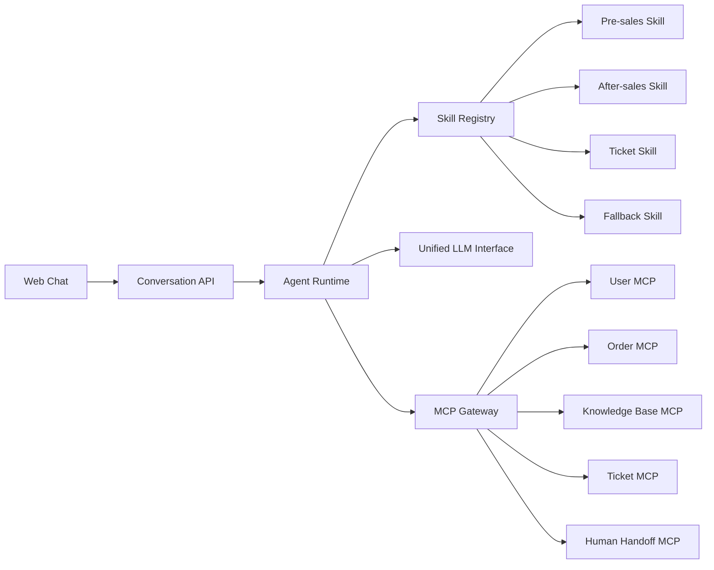

# 高解耦智能客服 Agent 架构规范

## Summary

本规范定义一套面向工程实现的智能客服 Agent 架构，技术方向为 Python/FastAPI。系统由轻量基础 Agent Runtime、领域型智能客服 Skill、MCP 工具服务组成。

基础框架只负责 Web 会话入口、短期状态、skill 注册、skill 匹配、skill 执行、LLM 统一接口、MCP 调用代理和审计。客服智能全部进入 skill。数据库、知识库、工单、订单、转人工等真实功能全部由 MCP 提供。

## Core Design

- 入口面向 Web 聊天窗口，Conversation API 同时支持普通响应和流式响应。
- 第一版 skill 采用领域 skill 颗粒度：售前、售后、工单、fallback。
- 每个 skill 是独立文件夹包，包含 manifest、SKILL.md、references/ 策略文件，以及可选 handler。
- skill 通过自注册 manifest 暴露能力，runtime 根据 skill 描述、意图、能力、优先级做粗匹配。
- 被选中的主 skill 负责完整对话体验，包括意图细分、槽位追问、话术策略、MCP 工具选择、跨 skill 转交。
- LLM 调用由 runtime 提供统一接口，skill 不直接绑定模型供应商。
- 短期状态保存任务态、槽位、当前意图和会话摘要。
- 长期用户、订单、工单、知识库等上下文通过 MCP 查询。
- 接口预留 tenant_id 和 brand_id，但第一版不展开完整多租户治理。

## Architecture Layers



## Responsibility Boundaries

### Agent Runtime

Agent Runtime 是基础运行层，不沉淀客服业务规则。

职责包括：

- 接收 Web 聊天请求。
- 维护短期会话状态。
- 加载和校验 skill manifest。
- 根据 manifest 做 skill 粗路由。
- 调用主 skill。
- 提供统一 LLM interface。
- 代理 MCP 工具调用。
- 记录完整调用审计。
- 输出普通响应或流式事件。

### Skill

Skill 是客服智能的主要承载单元。

职责包括：

- 意图识别和意图细分。
- 多轮任务编排。
- 槽位追问。
- 客服话术策略。
- MCP 工具选择。
- MCP 结果解释。
- 跨 skill 转交。
- 人工升级判断。
- fallback 澄清。

Skill 不直接访问数据库，不直接调用外部业务系统，不直接绑定具体模型供应商。

### MCP

MCP 是业务能力边界，也是权限校验边界。

职责包括：

- 查询用户、订单、工单、知识库等业务数据。
- 执行工单创建、工单更新、消息发送、转人工等业务动作。
- 对所有真实业务动作做强权限校验。
- 返回结构化、可解释、可审计的工具结果。

MCP 可以执行真实业务副作用，但必须由 MCP 服务自身进行权限、租户、用户、工具级别的强校验，不能只信任 agent 或 skill。

## Skill Package

每个 skill 使用独立文件夹包。

建议结构：

```text
skills/
  pre_sales/
    manifest.yaml
    SKILL.md
    references/
      policies.md
      tone.md
  after_sales/
    manifest.yaml
    SKILL.md
    references/
      policies.md
      refund_rules.md
  ticket/
    manifest.yaml
    SKILL.md
    references/
      escalation.md
  fallback/
    manifest.yaml
    SKILL.md
```

## Skill Manifest

Skill manifest 用于自注册和运行时匹配。

示例：

```yaml
name: after_sales
description: Handles after-sales customer service, including order status, logistics, returns, refunds, and complaint preparation.
domain: after_sales
priority: 80
capabilities:
  - order_status_explanation
  - logistics_tracking
  - return_and_refund_guidance
  - after_sales_complaint
intents:
  - ask_order_status
  - ask_logistics
  - request_return
  - request_refund
  - complain_after_sales
required_mcp_tools:
  - user.lookup
  - order.lookup
  - knowledge.search
  - ticket.create
  - handoff.request
input_schema:
  type: object
  required:
    - message
    - conversation_state
output_schema:
  type: object
  required:
    - answer
    - state_patch
handoff_policy:
  allowed: true
  reasons:
    - repeated_tool_failure
    - angry_customer
    - policy_exception
    - high_risk_request
```

## Skill Runtime Contract

### Input

Skill 执行输入应包含：

```json
{
  "conversation_id": "conv_001",
  "user_id": "user_001",
  "tenant_id": "tenant_001",
  "brand_id": "brand_001",
  "message": "我想查一下订单什么时候到",
  "conversation_summary": "用户正在咨询一个未完成订单的物流进度。",
  "task_state": {
    "active_intent": "ask_logistics",
    "slots": {
      "order_id": null
    }
  },
  "available_mcp_tools": [
    "user.lookup",
    "order.lookup",
    "knowledge.search",
    "ticket.create",
    "handoff.request"
  ]
}
```

### Output

Skill 执行输出应包含：

```json
{
  "answer": "我可以帮你查物流进度。请问你要查询的是最近一笔订单吗？",
  "state_patch": {
    "active_intent": "ask_logistics",
    "slots": {
      "order_id": null
    },
    "waiting_for": "order_confirmation"
  },
  "mcp_calls": [],
  "handoff": {
    "required": false,
    "reason": null
  },
  "transfer": {
    "target_skill": null,
    "reason": null
  }
}
```

## Conversation API

### Request

```http
POST /chat/messages
```

```json
{
  "conversation_id": "conv_001",
  "user_id": "user_001",
  "tenant_id": "tenant_001",
  "brand_id": "brand_001",
  "channel": "web",
  "message": "我的订单怎么还没到？",
  "context": {
    "page": "order_detail",
    "order_id": "order_001"
  },
  "stream": true
}
```

### Response

```json
{
  "answer": "我查到这笔订单已经到达你所在城市，预计今天 18:00 前派送。",
  "conversation_state": {
    "active_skill": "after_sales",
    "active_intent": "ask_logistics",
    "summary": "用户咨询 order_001 的物流进度，系统已查询并回复预计派送时间。"
  },
  "actions": [
    {
      "type": "mcp_call",
      "tool": "order.lookup",
      "status": "success"
    }
  ],
  "handoff_status": {
    "required": false,
    "reason": null
  },
  "trace_id": "trace_001"
}
```

## Streaming Events

流式响应建议采用事件模型，兼容 SSE。

事件类型包括：

- `message.delta`：模型或 skill 生成的增量回复。
- `tool.started`：MCP 工具调用开始。
- `tool.completed`：MCP 工具调用完成。
- `tool.failed`：MCP 工具调用失败。
- `handoff.started`：开始转人工。
- `state.updated`：会话状态更新。
- `message.completed`：本轮回复完成。

示例：

```json
{
  "event": "tool.completed",
  "trace_id": "trace_001",
  "data": {
    "tool": "order.lookup",
    "status": "success",
    "display_summary": "订单预计今天 18:00 前派送。"
  }
}
```

## MCP Tool Contract

MCP 工具返回结果采用结构化字段、状态码、可展示摘要、下一步建议。

示例：

```json
{
  "tool": "order.lookup",
  "status": "success",
  "data": {
    "order_id": "order_001",
    "order_status": "shipping",
    "logistics_status": "out_for_delivery",
    "estimated_delivery_time": "2026-06-02T18:00:00+08:00"
  },
  "display_summary": "订单已到达你所在城市，预计今天 18:00 前派送。",
  "suggested_next_actions": [
    "reply_to_user",
    "offer_handoff_if_user_is_unsatisfied"
  ],
  "permission": {
    "checked": true,
    "allowed": true
  },
  "trace": {
    "tool_call_id": "tool_call_001",
    "latency_ms": 130
  }
}
```

## First MCP Tools

第一版定义客服通用 MCP 工具，不绑定具体行业。

- `user.lookup`：查询用户基本信息、身份状态、可用上下文。
- `order.lookup`：查询订单、物流、支付、售后状态。
- `knowledge.search`：检索知识库候选内容和来源。
- `ticket.create`：创建工单。
- `ticket.update`：更新工单。
- `handoff.request`：请求转人工。
- `message.send`：发送系统消息或客服消息。

知识库采用 MCP 检索加 skill 解释模式。MCP 返回候选知识和结构化来源，skill 结合会话上下文生成最终回答。

## State Model

短期状态由 Agent Runtime 维护。

可保存内容：

- 当前 active skill。
- 当前 active intent。
- 已收集槽位。
- 等待用户补充的信息。
- 本轮任务状态。
- 会话摘要。
- 最近 MCP 调用摘要。

不保存内容：

- 完整长期用户画像。
- 完整订单数据。
- 完整工单详情。
- 完整知识库内容。

长期业务上下文必须通过 MCP 获取。

## Human Handoff

转人工是统一核心能力，所有领域 skill 都可以触发。

转人工请求应包含：

```json
{
  "conversation_id": "conv_001",
  "user_id": "user_001",
  "tenant_id": "tenant_001",
  "brand_id": "brand_001",
  "reason": "angry_customer",
  "conversation_summary": "用户对物流延迟不满，已查询订单并解释预计派送时间。",
  "active_skill": "after_sales",
  "active_intent": "ask_logistics",
  "tool_call_summary": [
    {
      "tool": "order.lookup",
      "status": "success"
    }
  ]
}
```

## Audit Trace

系统必须记录完整调用审计。

审计字段包括：

- trace_id
- conversation_id
- user_id
- tenant_id
- brand_id
- channel
- active_skill
- route_reason
- user_message_summary
- mcp_tool_name
- mcp_arguments_summary
- mcp_result_status
- handoff_status
- latency_ms
- error_code
- created_at

审计中应避免保存敏感原文参数。必要时保存摘要、脱敏值或引用 ID。

## Failure And Fallback

### No Skill Matched

无 skill 命中时调用 fallback skill。fallback skill 负责澄清、通用帮助或转人工。

### MCP Failure

MCP 工具失败时，skill 根据错误类型选择：

- 重试。
- 追问用户。
- 降级回答。
- 转人工。

### Missing Context

缺少必要用户信息或业务槽位时，skill 应先追问，不应编造结果。

### Permission Denied

MCP 权限校验失败时，skill 应解释无法执行的原因，并提供替代路径或转人工。

## End-to-End Flow

典型调用链：

1. Web 用户发送消息。
2. Conversation API 接收请求并创建 trace_id。
3. Agent Runtime 读取短期会话状态。
4. Skill Registry 根据 manifest 粗匹配候选 skill。
5. Runtime 选择主 skill。
6. 主 skill 识别细分意图和缺失槽位。
7. 主 skill 请求 MCP 工具。
8. MCP 服务执行权限校验并访问真实业务系统。
9. MCP 返回结构化结果和可展示摘要。
10. 主 skill 结合上下文解释结果。
11. Runtime 更新短期状态和审计。
12. Conversation API 返回普通响应或流式事件。

## Test And Evaluation

第一版使用离线用例集评估智能客服效果。

评估维度包括：

- skill 路由是否正确。
- 主 skill 是否能完成多轮任务。
- MCP 工具调用是否符合用户意图。
- 工具失败时是否正确兜底。
- 缺少上下文时是否追问。
- 转人工判断是否合理。
- 回复是否符合客服话术策略。

建议用例类型：

- 售前咨询：用户询问产品、价格、活动、使用方式。
- 售后咨询：用户查询订单、物流、退换货、退款。
- 工单投诉：用户表达强烈不满或需要人工介入。
- 无匹配问题：用户提出系统范围外请求。
- MCP 失败：订单查询失败、知识库无结果、权限不足。
- 多轮补槽：用户先表达模糊诉求，再补充订单号或问题类型。

## Assumptions

- 当前阶段只讨论和产出架构规范，不写业务代码。
- 第一版不做完整产品 MVP，不包含前端 UI 实现。
- 客服智能职责全部属于 skill，基础 runtime 不沉淀客服业务规则。
- MCP 是业务能力边界，也是权限校验边界。
- 多租户只预留字段，不展开租户配置中心、隔离策略和计费治理。
