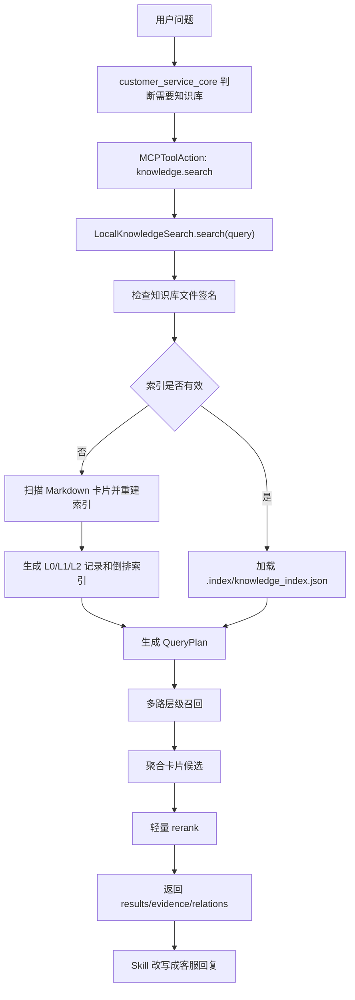

# Knowledge Search 检索流程与技术原理

本文档说明当前静态产品/政策知识检索的升级状态、运行流程、技术原理，以及它与 Skill、MCP、OpenViking 的关系。

## 结论

当前 `knowledge.search` 已升级为 OpenViking-lite 检索：

- 不使用向量数据库。
- 使用本地 Markdown 知识卡片作为静态资源。
- 使用 L0/L1/L2 层级索引。
- 使用规则型 QueryPlan 生成多路 `TypedKnowledgeQuery`。
- 使用倒排索引召回候选。
- 使用轻量 rerank 做精排。
- 返回证据片段、关联知识和命中原因。

静态知识检索不应该被 Skill 替代。推荐边界：

- Skill：判断什么时候查知识，以及如何把工具结果写成客服话术。
- MCP Tool：提供可插拔、可测试、可替换的知识检索能力。
- Knowledge Data：保存产品参数、政策、价保、售后、物流、发票、兼容性等静态资源。

## 代码位置

```text
backend/app/infrastructure/knowledge/local_search.py
backend/knowledge/**/*.md
backend/knowledge/.index/knowledge_index.json
skills/knowledge-base-authoring/
```

## 整体流程



## 知识卡片

知识卡片是 Markdown 文件，放在：

```text
backend/knowledge/<category>/<topic>.md
```

基本结构：

```markdown
---
title: Aurora Phone X1 参数
category: product
keywords:
  - Aurora Phone X1
  - 快充
  - 参数
updated_at: 2026-06-03
product_ids:
  - aurora phone x1
priority: 0.8
---

Aurora Phone X1 支持最高 80W 有线快充，并支持 30W 无线充电。
```

检索器会读取：

- `title`：标题，高权重。
- `category`：分类，用于路由和范围过滤。
- `keywords`：别名、核心词、用户常见表达，高权重。
- `product_ids`：同产品关联。
- `tags`：辅助标签。
- `priority`：业务优先级。
- 正文：用于证据片段和最终回答依据。

## 索引构建

索引文件：

```text
backend/knowledge/.index/knowledge_index.json
```

索引重建条件：

- `.index/knowledge_index.json` 不存在。
- `INDEX_VERSION` 变化。
- Markdown 文件路径、mtime 或 size 变化。

索引包含：

- `cards`：每张知识卡片的结构化数据。
- `records`：L0/L1/L2 层级记录。
- `inverted`：token 到 record 的倒排表。
- `document_frequency`：用于 IDF。
- `usage`：卡片命中次数和最近访问时间。

## L0/L1/L2 层级

| 层级 | 当前含义 | 作用 |
| --- | --- | --- |
| L0 | 分类摘要 | 先判断问题大概属于产品、政策、售后、物流等哪类资源 |
| L1 | 卡片概览 | 定位可能相关的知识卡片 |
| L2 | 正文片段 | 找到可回答用户问题的证据文本 |

这借鉴了 OpenViking 的层级上下文思想：先走摘要和目录，再进入叶子内容。

## QueryPlan

`LocalKnowledgeSearch` 会把用户原始问题转换成多个 `TypedKnowledgeQuery`。

结构：

```python
TypedKnowledgeQuery(
    query="Aurora Phone X1 支持多少瓦快充？",
    intent="product_question",
    categories=("product", "compatibility"),
    priority=5,
)
```

当前 QueryPlan 是规则型生成，不调用 LLM。

生成逻辑包括：

- 根据关键词推断分类：产品、政策、促销、售后、物流、发票等。
- 根据问题推断意图：价保、商品参数、售后政策、物流规则等。
- 根据同义词扩展 query：价保/保价/差价、快充/充电/充电器等。
- 根据产品别名扩展 query：`Aurora Phone X1`、`x1`、`极光手机` 等。

## 多路召回

每个 `TypedKnowledgeQuery` 会单独召回候选。

召回过程：

1. 对 query 分词，生成中文 n-gram 和英文数字 token。
2. 在 L0/L1 上打分，得到导航范围。
3. 根据导航范围选择分类和卡片源。
4. 在 L2 正文片段上打分。
5. 如果范围内没有结果，退回全局 top-k。
6. 聚合正文片段分、卡片概览分、分类分和业务路由分。

这样比单次关键词搜索更稳：同一个问题可以同时从“产品参数”“兼容性”“政策规则”等路径召回。

## 评分与 Rerank

当前不是向量 rerank，而是确定性的轻量 rerank。

最终分数主要来自：

- `recall_score`：倒排索引召回分。
- `title_overlap`：标题与 query 的重合。
- `keyword_overlap`：关键词与 query 的重合。
- `body_overlap`：摘要/正文与 query 的重合。
- `category_hits`：query plan 路由分类命中。
- `exact_bonus`：产品别名、价保、快充等关键短语命中。
- `evidence_bonus`：命中的正文证据数量。
- `hotness`：卡片命中次数和时间衰减。

OpenViking 中 hotness 的思想是访问频率与时间衰减结合。当前实现使用：

```text
hotness = sigmoid(log1p(active_count)) * time_decay(last_accessed_at)
```

## 返回结果

`knowledge.search` 成功时返回：

```json
{
  "tool": "knowledge.search",
  "status": "success",
  "data": {
    "query": "...",
    "query_plan": [],
    "results": [],
    "index": {
      "method": "openviking_lite_query_plan_hierarchical_rerank"
    }
  }
}
```

每条 result 包含：

- `title`
- `category`
- `summary`
- `source`
- `score`
- `keywords`
- `evidence`
- `relations`
- `match_reason`

其中 `evidence` 给客服回复提供依据，`relations` 帮助后续追问或多卡片联动。

## 与 OpenViking 的对应关系

| OpenViking | 当前实现 | 差异 |
| --- | --- | --- |
| `ContextType.RESOURCE` | `knowledge.search` | 产品/政策知识作为静态资源 |
| `TypedQuery` / `QueryPlan` | `TypedKnowledgeQuery` | 规则快速路径 + 低置信度 LLM planner + 本地规则兜底 |
| 层级检索 | L0/L1/L2 本地索引 | 不接 VikingFS |
| dense/sparse vector | 本地倒排索引 + IDF | 暂不使用 embedding |
| rerank client | 规则型 rerank | 暂不接外部 reranker |
| hotness score | usage + time decay | 本地记录访问热度 |

## 为什么不改成 Skill

不建议把静态知识检索改成 Skill。

原因：

- 检索是数据访问能力，应该是 MCP tool。
- Skill 是策略层，负责决定是否查、如何解释结果。
- 如果把检索写进 Skill，后续替换 MySQL、ES、向量库或 OpenViking 服务会更困难。
- MCP 工具更容易测试、审计、限权和替换。

因此新增的是 `knowledge-base-authoring` skill，用于生成和维护知识卡片，而不是替代 `knowledge.search`。

## 后续升级路线

1. 把产品别名、同义词、分类路由从代码迁移到配置文件。
2. 把 Markdown 知识卡迁入 MySQL，增加上下架、版本、审核状态和适用渠道。
3. 增加 LLM query planner，让 search 支持会话上下文查询扩展。
4. 引入 reranker，但保留当前倒排索引作为可解释召回层。
5. 增加知识库评测集，覆盖价保、快充、退货、发票、物流、兼容性等常见问题。
