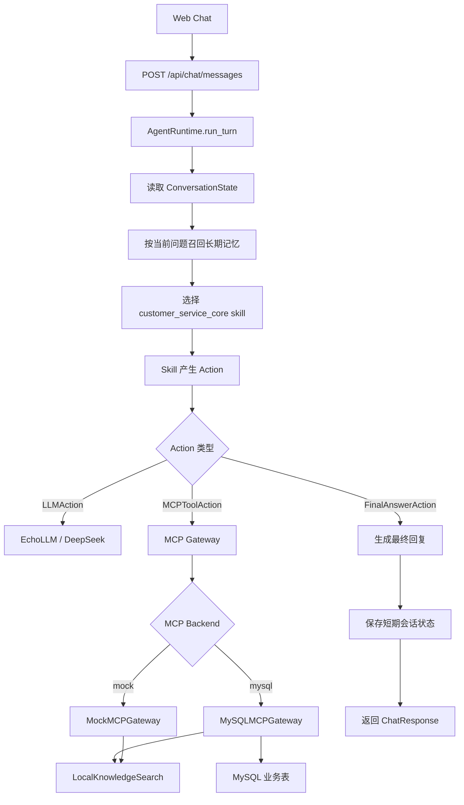
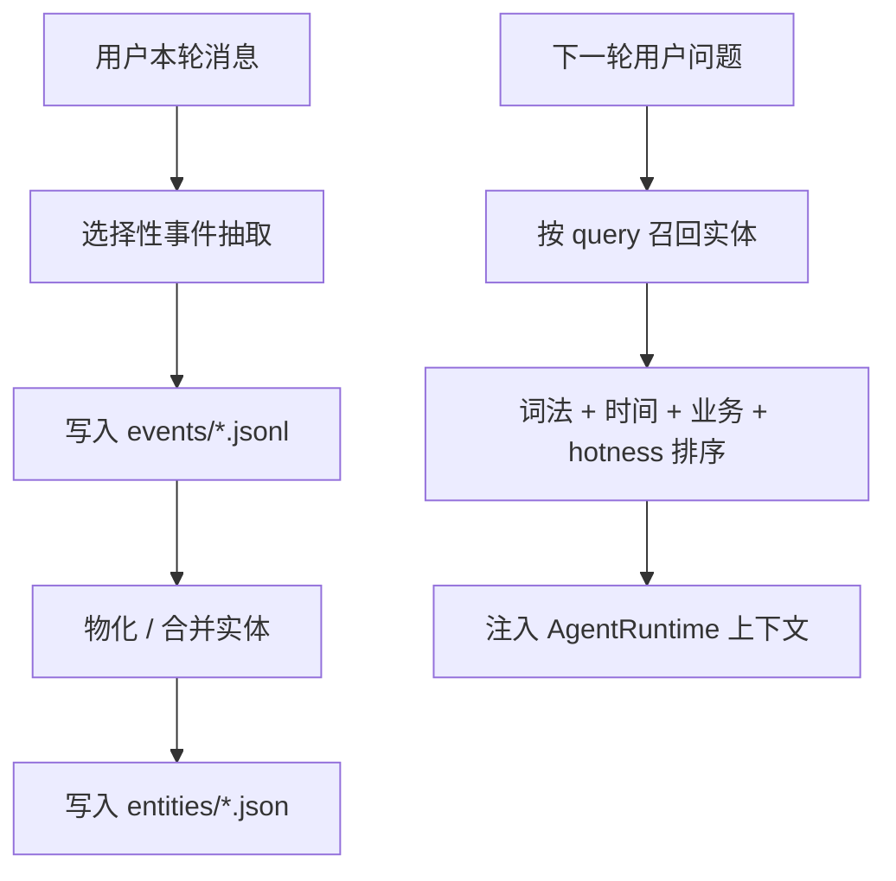

# 智能客服系统技术实现说明

本文档记录当前项目的基础实现状态，方便后续继续把 MCP 工具、知识库、数据库和智能客服 Agent 做成更完整的生产级系统。

## 1. 当前实现结论

当前系统已经完成一个可运行的智能客服基础版本：

- 前端提供 Web Chat 界面，支持用户 ID、会话 ID、消息发送、技能/记忆/trace 展示。
- 后端使用 FastAPI 暴露聊天接口，由 `AgentRuntime` 统一调度技能、LLM、MCP 工具和记忆。
- MCP 工具层已经支持从 mock 切换到 MySQL 网关。
- MySQL 中已经建有用户、会员、地址、订单、商品明细、支付、物流、售后、工单、人工转接等业务表。
- `knowledge.search` 已实现简易版 OpenViking 风格本地索引检索，不依赖向量数据库。
- 系统支持订单归属校验，避免用户直接查到不属于自己的订单。
- 系统支持创建工单和提交人工客服转接请求。
- 登录用户会固定当前身份，前端会话记录按用户隔离，避免沿用其他用户短期记忆。

## 2. 目录结构

```text
backend/
  app/
    agent/                    # Agent 编排、动作协议、技能注册、执行器
    api/                      # FastAPI 路由
    core/                     # 配置读取
    infrastructure/
      knowledge/              # 本地知识库索引检索
      llm/                    # Echo / DeepSeek LLM 适配器
      mcp/                    # Mock / MySQL MCP 网关
      memory/                 # 长期 Event-Entity 记忆
      sessions/               # 当前内存型短期会话
      skills/                 # 文件型 skill 加载器
    schemas/                  # API 入参出参模型
  db/
    schema.sql                # MySQL 建表脚本
    seed.sql                  # MySQL 模拟数据脚本
  knowledge/                  # 本地知识库 Markdown 卡片
  memory/                     # 按用户写入的长期记忆
  tests/                      # 后端测试

frontend/
  src/                        # React 聊天界面

skills/
  customer_service_core/      # 当前客服核心 skill

docs/
  agent-architecture.md
  customer-service-skill-design.md
  mcp-capability-design.md
  technical-implementation-overview.md
```

## 3. 请求处理流程



### API

后端入口：

- `GET /health`
- `POST /api/chat/messages`

聊天请求模型：

```json
{
  "conversation_id": "conv_xxx",
  "user_id": "user_test",
  "message": "我的订单 64575145823542368 现在什么情况？",
  "channel": "web",
  "stream": false
}
```

聊天响应包含：

- `answer`：最终客服回复
- `conversation_state`：当前技能、意图、摘要、短期记忆、长期记忆
- `actions`：本轮执行过的动作
- `handoff_status`：是否需要人工转接
- `trace_id`：链路追踪 ID

## 4. Agent 与 Skill

当前核心编排在 `backend/app/agent/runtime.py`。

核心职责：

- 根据 `conversation_id` 读取短期会话状态。
- 根据 `user_id` 和当前问题召回相关长期记忆。
- 选择并运行客服 skill。
- 执行 skill 返回的动作，例如 LLM 调用、MCP 工具调用、最终回复、转人工。
- 保存更新后的 `ConversationState`。

当前客服能力来自：

```text
skills/customer_service_core/
  manifest.yaml
  SKILL.md
```

这个 skill 负责定义客服身份、业务边界、MCP 工具使用策略、订单安全校验、售后/转人工策略等。

## 5. MCP 工具层

当前 MCP 网关有两个实现：

- `MockMCPGateway`：用于无数据库时的模拟运行。
- `MySQLMCPGateway`：用于连接真实 MySQL 业务数据。

MySQL 模式下已经拆成 MCP 插件结构：

```text
backend/app/infrastructure/mcp/customer_service/
backend/app/infrastructure/mcp/mysql_gateway.py
```

其中：

- `CustomerServiceMCPPlugin` 是客服 MCP 工具包入口，负责注册和分发客服工具。
- `MySQLMCPGateway` 是薄适配器，只负责提供 MySQL 连接工厂，并把调用交给插件。
- 每个工具由独立 handler 类实现，集中在 `customer_service/tools.py`，例如 `OrderLookupTool`、`TicketCreateTool`。
- `knowledge.search` 不需要数据库连接，仍由插件统一托管。

配置开关在 `backend/.env`：

```env
CS_AGENT_MCP_BACKEND=mysql
CS_AGENT_MYSQL_HOST=localhost
CS_AGENT_MYSQL_PORT=3306
CS_AGENT_MYSQL_USER=root
CS_AGENT_MYSQL_PASSWORD=replace-with-your-mysql-password
CS_AGENT_MYSQL_DATABASE=customer_service_agent
```

当前已实现工具：

| 工具名 | 当前实现 | 说明 |
| --- | --- | --- |
| `knowledge.search` | 本地知识库索引 | 查询商品、政策、售后、物流等知识 |
| `user.lookup` | MySQL | 查询当前用户服务上下文，返回身份状态、会员概览、脱敏联系方式提示和最近订单提示 |
| `order.lookup` | MySQL | 查询订单总览和商品明细，并校验用户归属 |
| `shipment.lookup` | MySQL | 查询订单物流、承运商、运单号和预计送达时间 |
| `payment.lookup` | MySQL | 查询订单支付状态、支付方式和脱敏交易信息 |
| `after_sales.lookup` | MySQL | 查询订单关联售后记录 |
| `ticket.create` | MySQL | 创建客服工单 |
| `handoff.request` | MySQL | 创建人工客服转接排队记录 |

注意：`knowledge.search` 即使在 MySQL MCP 模式下，也仍然走本地 `LocalKnowledgeSearch`，因为当前知识库没有迁入 MySQL。

`user.lookup` 的返回不是原始用户表，而是安全服务上下文：

```text
identity: user_id / display_name / account_status / authenticated / scope
preferences: preferred_language
membership: member_level / points / growth_value
contact_hints: phone_masked / email_masked / full_contact_hidden
recent_order_hint: 最近订单号
recent_orders: 最近订单号、订单状态、创建时间
```

它不返回完整手机号、完整邮箱、地址、密码、凭证或任意其他用户资料。

### MCP 审计日志

MCP plugin 层已经增加轻量审计日志：

```text
backend/app/infrastructure/mcp/customer_service/audit.py
backend/logs/mcp_audit.jsonl
```

每次 MCP 工具调用都会记录一行 JSONL，包括：

- `timestamp`
- `trace_id`
- `conversation_id`
- `user_id`
- `tool`
- `status`
- `error_code`
- `duration_ms`
- 参数摘要
- 权限摘要
- 建议下一步动作

Agent 执行工具前会把当前 `trace_id` 注入 `_meta`，这样可以把一次用户请求、Agent trace 和 MCP 工具调用串起来。审计日志只记录参数摘要，不写完整密码、token、交易流水、手机号、邮箱、地址等敏感字段。

### Tool Schema

当前 Agent 框架已经增加显式工具契约：

```text
backend/app/agent/tool_registry.py
```

`ToolRegistry` 负责注册每个工具的：

- 工具名
- 工具说明
- 参数名、参数类型、是否必填
- 是否需要用户身份
- 权限等级
- 失败后的建议动作

工具调用现在会先经过 Agent 框架校验，再进入 MCP Gateway：

```text
Skill / CapabilityAction
  -> Agent ActionExecutor
  -> ToolRegistry.validate()
  -> MCPGateway.call_tool()
```

这意味着 Skill 依赖的是工具契约，Agent 负责契约治理，MCP 只负责执行已经合法的工具调用。这样更利于后续把 Skill、Agent 框架和 MCP 工具独立拆分。

## 5.1 标准 Action Result

Agent 内部的 `Observation` 已经扩展为标准 action 执行结果结构：

```text
backend/app/agent/actions.py
```

当前标准字段包括：

- `action_id`：由 `trace_id + step` 生成的单步 action 标识
- `type`：action 类型，例如 `llm`、`capability`、`mcp_tool`、`final_answer`
- `name`：action 名称，例如 capability 名、工具名、LLM purpose
- `status`：`success`、`failed` 或 `terminal`
- `content`：文本结果
- `data`：结构化结果
- `summary`：给 UI 或日志展示的摘要
- `error_code`：标准错误码
- `suggested_next_actions`：失败或异常后的建议动作

`TurnContext.record()` 是标准化入口，会为每条 observation 自动补全 `action_id` 和 `name`。

MCP 工具结果也会被归一化：

- MCP 返回 `status=failed` 时，Agent observation 也会标记为 `failed`。
- MCP 返回的 `error_code` 会透传到 observation。
- MCP 返回的 `suggested_next_actions` 会透传到 observation。
- Tool Schema 校验失败时，不会进入 MCP，会直接生成标准失败 observation。

## 5.2 Agent Trace 事件流

Agent 框架已经增加轻量 trace event stream，用于记录每轮对话的通用执行链路。

响应字段：

```text
ChatResponse.trace_events
```

事件结构：

```text
TraceEvent
  sequence
  event
  step
  details
```

当前事件包括：

- `turn_started`：本轮对话开始
- `skill_selected`：选择到的 skill
- `action_planned`：skill 计划执行某个 action
- `action_observed`：action 执行完成并得到 observation
- `step_limit_reached`：达到最大执行步数
- `state_saved`：会话状态已保存
- `turn_completed`：本轮对话完成

Trace 事件流只记录 Agent 框架的通用执行过程，不写入客服业务规则，也不替代 MCP 工具结果。它的作用是方便调试、审计、测试和后续前端可视化。

## 5.3 Guardrail 层

Agent 框架已经增加轻量 Guardrail 层：

```text
backend/app/agent/guardrails.py
```

Guardrail 层位于 Skill 和 ActionExecutor 之间：

```text
Skill plans action
  -> GuardrailEngine.before_action()
  -> ActionExecutor.execute()
  -> GuardrailEngine.after_observation()
  -> TurnContext.record()
```

当前边界：

- Guardrail 只做通用安全治理。
- Guardrail 不查询数据库。
- Guardrail 不理解订单、售后、价保等具体业务规则。
- Guardrail 不替代 MCP 权限校验。
- Guardrail 不替代 Tool Schema 参数校验。

当前规则：

- 如果某个工具 schema 声明 `requires_identity=True`，但当前请求没有用户身份，Guardrail 会在进入 MCP 前阻断调用。
- 如果敏感访问失败，例如 `permission_denied`、`missing_identity` 或 `guardrail_missing_identity`，Guardrail 会在 `task_state.guardrail_last_failure` 中记录最后一次安全失败，并写入 `guardrail_flagged` trace event。

相关 trace event：

- `guardrail_blocked`：执行前被 Guardrail 阻断。
- `guardrail_flagged`：执行后发现敏感访问失败。

这层的目标是让安全检查有统一入口，避免每个 skill 都需要自己记得处理同类边界。

## 6. MySQL 数据模型

建表脚本：

```text
backend/db/schema.sql
```

模拟数据脚本：

```text
backend/db/seed.sql
```

主要表：

- `users`：用户基础资料
- `memberships`：会员等级、积分、成长值
- `user_addresses`：收货地址
- `orders`：订单主表
- `order_items`：订单商品明细
- `payments`：支付信息
- `shipments`：物流信息
- `after_sales`：售后记录
- `tickets`：客服工单
- `ticket_events`：工单事件
- `handoff_requests`：人工客服转接请求

已验证的典型测试数据：

- `user_test`：拥有订单 `64575145823542368`
- `user_demo`：拥有订单 `202606030001`
- `user_vip`：高等级会员模拟用户

订单查询时会执行归属校验：

- 如果订单存在且 `order.user_id == request.user_id`，返回订单详情。
- 如果订单存在但不属于当前用户，返回 `permission_denied`，建议补充核验信息或转人工。
- 如果订单不存在，返回 `not_found`。

订单相关 MCP 工具共用同一套安全入口：

```text
order.lookup
shipment.lookup
payment.lookup
after_sales.lookup
  -> _fetch_owned_order()
  -> 校验订单存在
  -> 校验订单归属当前 user_id
  -> 只返回该工具职责范围内的数据
```

其中 `payment.lookup` 会对交易流水号等敏感字段脱敏，避免将完整支付流水暴露给前端或模型上下文。

## 7. Knowledge Search

当前知识库没有使用向量数据库，而是参考 OpenViking 的 `find/search`、`TypedQuery`、层级检索和 rerank 思路做了简化版本地资源检索。

代码位置：

```text
backend/app/infrastructure/knowledge/local_search.py
```

知识库内容：

```text
backend/knowledge/**/*.md
```

索引缓存：

```text
backend/knowledge/.index/knowledge_index.json
```

`.index` 目录是运行时生成产物，已加入忽略，不需要手动维护。

当前策略：

- 扫描 Markdown 知识卡片。
- 抽取标题、分类、正文、关键词、产品 ID、标签、来源路径。
- 构建 L0 分类摘要、L1 卡片概览、L2 正文片段三级记录。
- 构建倒排索引和卡片使用热度，不依赖向量数据库。
- 查询时先生成规则型 `TypedKnowledgeQuery`，包含 query、intent、categories、priority。
- 使用多路查询计划分别召回，再聚合候选卡片。
- 对候选结果做轻量 rerank，综合标题、关键词、正文证据、业务分类、产品别名、访问热度。
- 返回 `query_plan`、`evidence`、`relations` 和 `match_reason`，方便 skill 写出可解释回复。

当前返回结构中，`data.results[]` 包含：

- `title`：知识卡片标题。
- `category`：资源分类。
- `summary`：卡片摘要。
- `evidence`：命中的正文证据片段。
- `relations`：同产品或同分类的关联知识。
- `match_reason`：命中原因。

### 与 OpenViking 的对应关系

| OpenViking | 当前项目实现 | 说明 |
| --- | --- | --- |
| `ContextType.RESOURCE` | `knowledge.search` | 静态产品、政策、FAQ 属于资源检索 |
| `TypedQuery` / `QueryPlan` | `TypedKnowledgeQuery` | 规则快速路径 + 低置信度 LLM planner + 本地规则兜底 |
| L0/L1/L2 层级上下文 | 分类 / 卡片 / 正文片段 | 保留层级递进检索思想 |
| global search + recursive search | 分类导航 + 卡片概览 + 片段检索 | 本地倒排索引版本 |
| rerank | deterministic rerank | 不接外部 reranker，先用可测试规则 |
| hotness score | usage active_count + time decay | 命中过的知识会获得轻微热度加权 |

### 是否用 Skill 替代

不建议用 Skill 替代静态知识检索。

更合理的职责边界是：

- Skill：判断用户意图，决定是否调用 `knowledge.search`，并把检索结果改写成客服回复。
- MCP Tool：执行可测试、可插拔、可替换的知识检索。
- Knowledge Data：保存产品参数、政策、FAQ、活动、售后说明等静态资源。

原因：

- 静态知识检索是数据访问能力，不是对话策略本身。
- 如果把检索逻辑塞进 Skill，Skill 会变重，MCP 可插拔性会下降。
- OpenViking 也把 skill、resource、memory 作为不同上下文类型处理；产品/政策知识更接近 resource。
- 后续如果把本地 Markdown 换成 MySQL、Elasticsearch、向量库或 OpenViking 服务，只需要替换 MCP 工具实现，不需要改客服 Skill。

与传统向量库相比：

- 优点：不需要 embedding 模型和向量数据库，部署简单，可解释性强。
- 缺点：语义泛化能力弱，复杂同义表达和长上下文召回能力有限。

后续可以继续增强：

- 把知识卡片迁入 MySQL 或对象存储。
- 为知识卡片增加版本、上下架、适用渠道、适用产品线字段。
- 增加可配置同义词词典、产品别名词典和业务分类路由。
- 增加 LLM query planner，把规则型 `TypedKnowledgeQuery` 升级为上下文感知查询计划。
- 逐步引入 reranker 或 hybrid search，但保留当前索引作为可解释召回层。

## 8. 记忆机制

当前有两类记忆：

### 短期记忆

位置：

```text
backend/app/infrastructure/sessions/memory_store.py
```

特点：

- 按 `conversation_id` 保存。
- 当前是进程内内存存储。
- 主要用于本轮会话上下文、最近消息、当前 active skill/intent。
- 服务重启后会丢失。

### 长期记忆

位置：

```text
backend/app/infrastructure/memory/event_entity_store.py
backend/app/infrastructure/memory/markdown_store.py
backend/memory/
```

特点：

- 默认实现是 `EventEntityMemoryStore`，参考 VikingMem / OpenViking 的 Event-Entity Memory 思路。
- 按 `user_id` 写入事件日志和实体索引，而不是把整段对话原文直接保存。
- `events/*.jsonl` 保存筛选后的高价值事件，例如用户称呼、服务偏好、订单咨询、价保关注、人工客服需求。
- `entities/*.json` 保存由事件物化出来的用户画像、服务偏好、客户问题、购买/咨询偏好。
- 每轮对话加载记忆时，会根据当前问题做 query-aware retrieval，只召回最相关的实体。
- 排序使用词法命中、时间衰减、业务权重、hotness 分数的组合，属于不依赖向量数据库的 OpenViking-lite 检索。
- `markdown_store.py` 仍保留为兼容和测试用实现，不再是默认运行时记忆。

当前长期记忆流程：



### 前端会话切换

前端在用户 ID 变化时会生成新的 `conversation_id`，避免用户直接修改 ID 后继续复用旧短期记忆。

位置：

```text
frontend/src/App.tsx
```

## 9. 前端

当前前端是 Vite + React。

启动方式：

```bash
cd frontend
npm install
npm run dev
```

默认地址：

```text
http://localhost:5173
```

前端默认调用：

```text
http://localhost:8001/api/chat/messages
```

如需覆盖后端地址，可以配置：

```env
VITE_API_BASE_URL=http://localhost:8001
```

当前页面能力：

- 输入用户 ID。
- 发送聊天消息。
- 显示用户和助手消息。
- 显示 active skill、短期记忆数量、trace ID。
- 清空显示并开启新会话。

## 10. 本地运行

### 后端

```bash
cd backend
python -m venv .venv
.venv\Scripts\activate
pip install -e .[dev]
uvicorn app.main:app --reload --port 8001
```

### 数据库

先确认 MySQL 已启动，然后执行建表和种子数据。

建议使用支持 UTF-8 的方式执行 SQL，避免 Windows PowerShell 管道导致中文乱码。

当前连接配置：

```text
host: localhost
port: 3306
user: root
password: replace-with-your-mysql-password
database: customer_service_agent
```

### 前端

```bash
cd frontend
npm install
npm run dev
```

## 11. 测试与验证

后端测试：

```bash
cd backend
.venv\Scripts\python.exe -m pytest
```

前端构建：

```bash
cd frontend
npm run build
```

当前已验证：

- 后端测试通过。
- 前端 TypeScript + Vite 构建通过。
- MySQL 模式下订单查询、用户查询、工单创建、人工转接可用。
- 错误用户查询订单时会被权限拒绝。
- 切换用户 ID 后会开启新的前端会话。

## 12. 当前边界和后续优化方向

当前系统仍然是基础演示版，后续建议按下面顺序继续增强：

1. 把短期会话从内存迁移到 Redis 或 MySQL，避免服务重启丢上下文。
2. 把长期 Event-Entity 记忆迁移到 MySQL 表，增加版本、审计和删除能力。
3. 给 MCP 工具增加更完整的审计日志和后台管理页。
4. 把知识库从纯 Markdown 管理升级为可版本化、可上下架、可按产品线过滤的数据源。
5. 为知识检索和记忆检索增加 query rewrite、同义词词典、reranker 或 hybrid search。
6. 增加客服评测集，覆盖订单、售后、价保、发票、物流异常、转人工等场景。
7. 增加更严格的登录态鉴权和接口权限校验。
8. 增加流式输出和更完整的前端状态展示。
